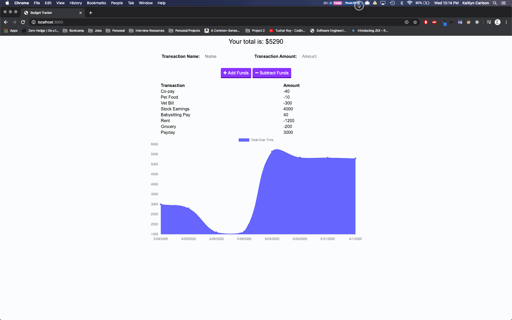
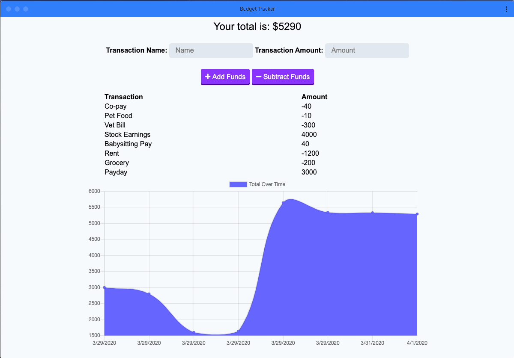

# PWA Budget Tracker

Installable Budget Tracker PWA with offline and online capabilities. Much of this application was built during an in-class activity during the University of Washington Full-stack Web Development Bootcamp. In this rendition we were tasked with creating a Service Worker and Manifest in order to make this application a PWA.

Check out the app on Heroku today: [PWA Budget Tracker](https://afternoon-reef-37574.herokuapp.com/)

## Table of Contents

- [Overview](#Overview)
- [Technologies](#Technologies)
- [Install Budget Tracker on Device](#Install-Budget-Tracker-on-Device)
- [Run Application Locally](#Run-Application-Locally)
- [Functionality](#Functionality)

## Overview

Budget Tracker emables users to add expenses and deposits to their budget. They can do so both with a network connection and without one. If, the users enters transactions while there is no network connection that data will populate the budget total when the network is available.

Budget Tracker is a PWA. What does that mean for the Buget Tracker App? It is installable- users can interact with Budget Tracker as if it was a native app on their device. It can load without any network connecton and sync updates without interferring with the user's experience on the front-end of the application.

## Technologies

- JavaScript
- IndexedDB
- Express
- MongoDB
- Mongoose
- Font Awesome
- Bootstrap

## Install Budget Tracker on Device

The giphy provided below demonstrates how users can install Budget Tracker onto their device:



## Run Application Locally

To run this program locally, you can fork this repository and open it in your local coding program. Use the following command to install the required dependencies:

```sh
npm install
```

The application is then invoked with the following command:

```sh
node server.js
```

## Functionality

An example interaction of adding an expense to our installed Buget Tracker is provided in the giph below:



### Behind the Scenes Functionality

If you navigate to our `index.html` file, which resides inside of our client folder, you will notice something strange. We have some script code written directly in our HTML. Why? This is a small application, so it makes sense to register our service worker right here! We do this by first loading all of our dependant files, for the sake of asynchronous loading, and then we register our service worker with this code here:

```sh
<script type="text/javascript">
      if ("serviceWorker" in navigator) {
        navigator.serviceWorker
          .register("./service-worker.js", {
            scope: "/"
          })
          .then(res => {
            console.log(res);
            console.log("Service Worker registered successfully.");
          })
          .catch(error =>
            console.log("Service Worker registration failed:", error)
          );
      }
```

This code registers our service worker from the file located inside our client folder, `service-worker.js`. Our `service-worker.js` file handles caching public files, installation, and fetching.

We also need a `manifest.webmanifest` file in order to create out PWA. This manifest is imported into our `index.html` file within the `HEAD` element. Since this is a relatively simple application, I kept the manifest relatively simple as well. Notice that our manifest is written in JSON script style:

```sh
{
  "name": "Budget Tracker",
  "short_name": " Budget Tracker",
  "icons": [
    {
      "src": "/assets/images/budgetIcon.png",
      "sizes": "512x512",
      "type": "image/png"
    }
  ],
  "theme_color": "#ffffff",
  "background_color": "#ffffff",
  "start_url": "/",
  "display": "standalone"
}

```
